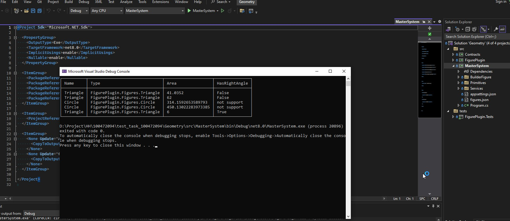
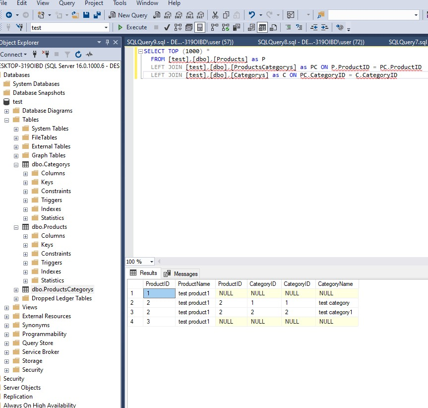

# Библиотека для расчета площади

Задание:

Напишите на C# библиотеку для поставки внешним клиентам, которая умеет вычислять площадь круга по радиусу и треугольника по трем сторонам. Дополнительно к работоспособности оценим:
    Юнит-тесты
    Легкость добавления других фигур
    Вычисление площади фигуры без знания типа фигуры в compile-time
    Проверку на то, является ли треугольник прямоугольным

## Структура Проекта

* MasterSystem Проект загружающий плагин и выполняющий обработку фигур

* Contracts Список интерфейсов для создания фигур в плагине. Передоставляет описание атрибутов для передачи метаинформации по фигурам.

* FigurePlugin Плагин(библиотека) для поставки внешним клиентам. Файлы с расширением .sample для добавления новых фигур.

* FigurePlugin.Tests Тесты для фигур.



-----------------------------
В базе данных MS SQL Server есть продукты и категории. Одному продукту может соответствовать много категорий, в одной категории может быть много продуктов. Напишите SQL запрос для выбора всех пар «Имя продукта – Имя категории». Если у продукта нет категорий, то его имя все равно должно выводиться.

```
CREATE TABLE Products
(
    ProductID INT  NOT NULL IDENTITY(1,1) PRIMARY KEY,
    ProductName VARCHAR(100)
)

CREATE TABLE Categorys
(
    CategoryID INT  NOT NULL IDENTITY(1,1) PRIMARY KEY,
    CategoryName VARCHAR(100)
)

CREATE TABLE ProductsCategorys
(
    ProductID INT NOT NULL FOREIGN KEY REFERENCES Products(ProductID),
    CategoryID INT NOT NULL FOREIGN KEY REFERENCES Categorys(CategoryID), 
    PRIMARY KEY (AuthorID, BookID)
)

```


```
SELECT TOP (1000) *
  FROM [test].[dbo].[Products] as P
  LEFT JOIN [test].[dbo].[ProductsCategorys] as PC ON P.ProductID = PC.ProductID
  LEFT JOIN [test].[dbo].[Categorys] as C ON PC.CategoryID = C.CategoryID
```


